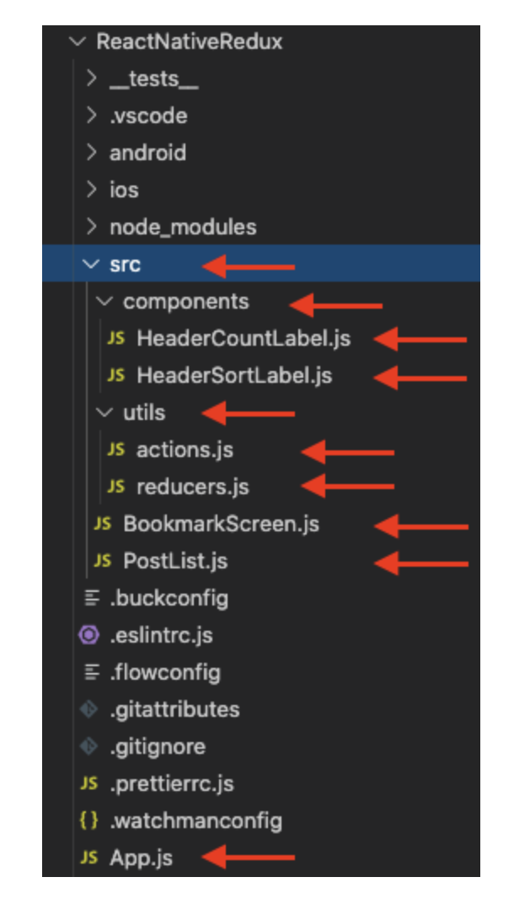
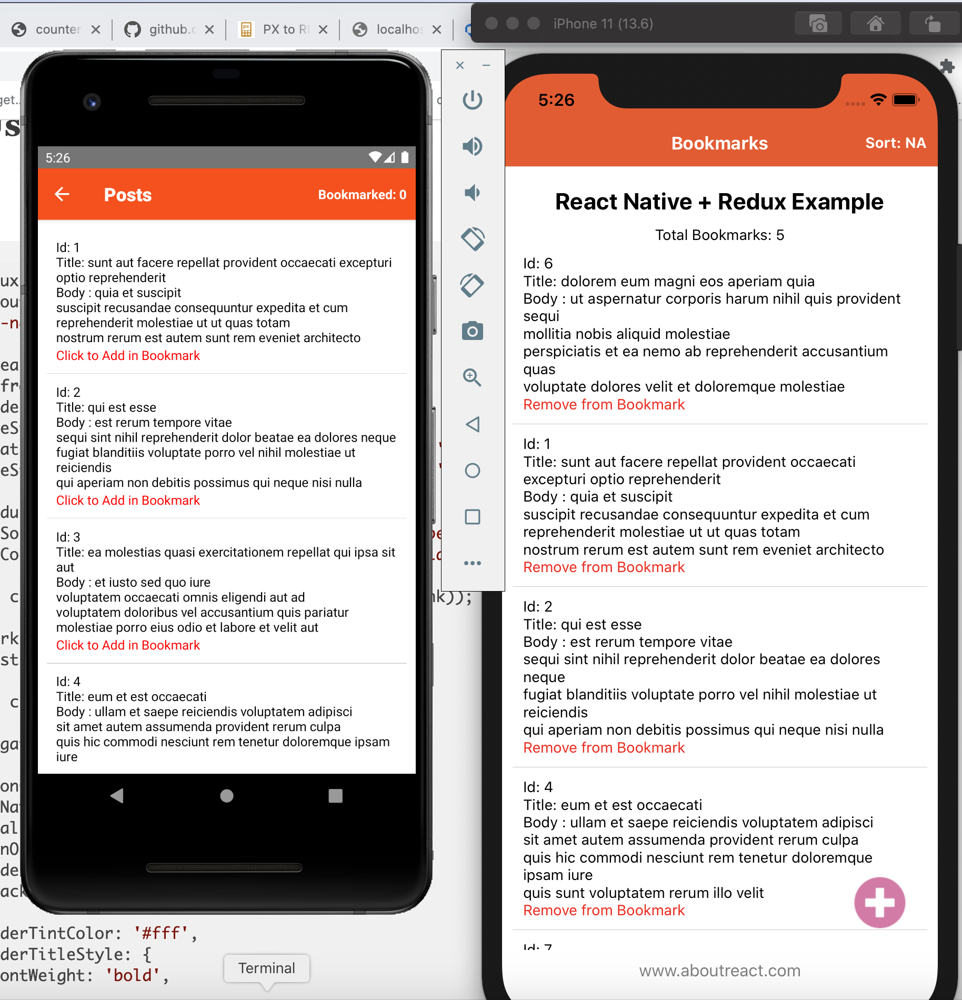
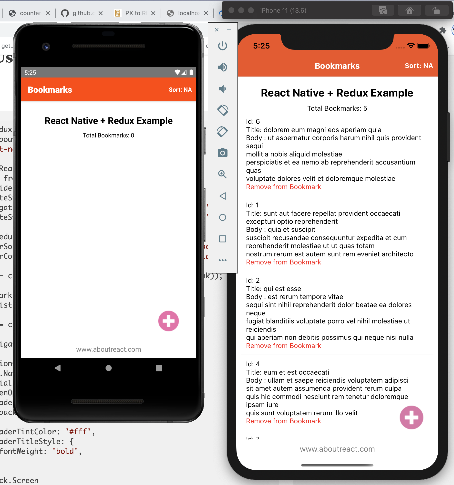
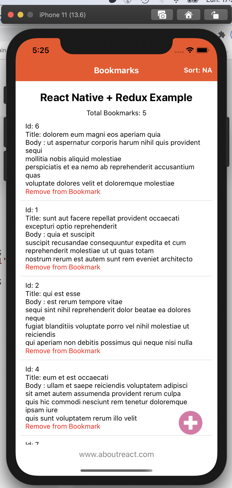
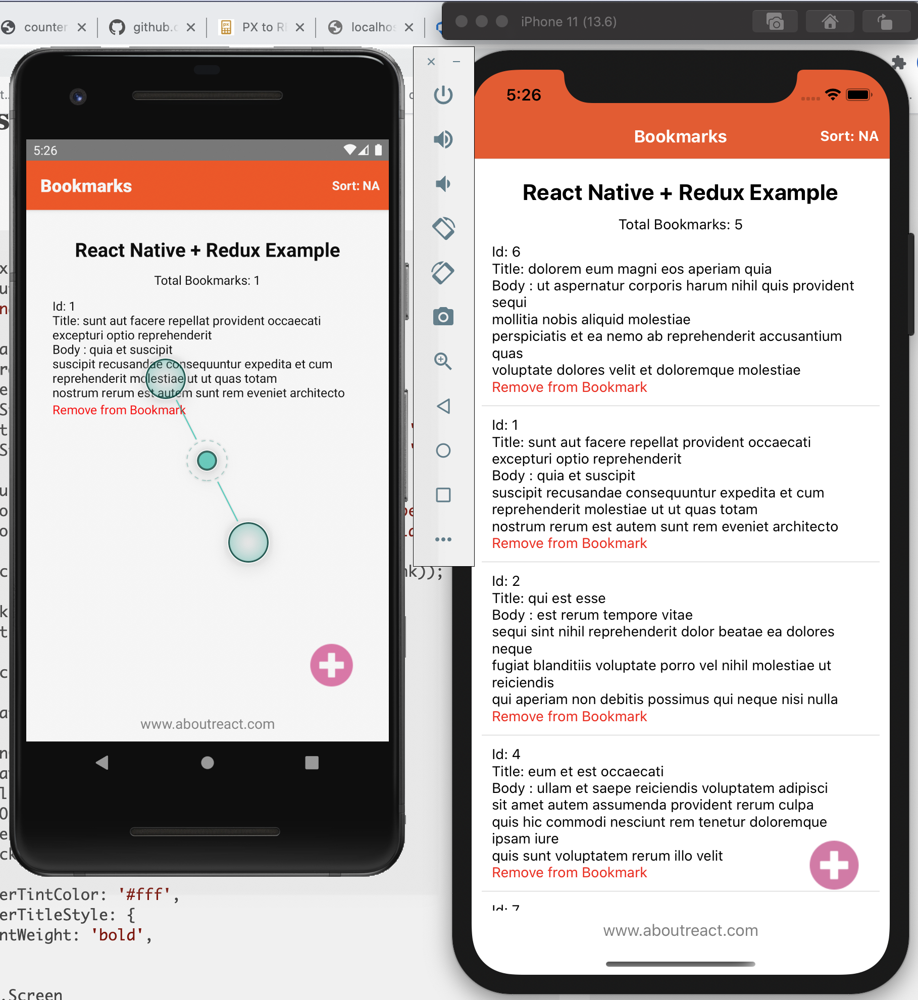
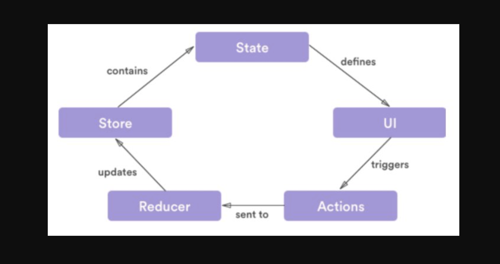

#  React Native Redux
Here is an example to use Redux in React Native App. We all know Redux is a state management library which will help you to
manage all your state in one place called store. Integration of Redux in React Native is very easy with the help of React Redux.
In this example we will see.

1 . Setup of Redux library in your React Native App
2 . managing of state in a single page
3 . dispatch actions and handle them in reducers
4 . use of different state from the Redux store

We request all the readers who are new in React Native and want to learn this concept, please spend some time in understanding props,
state and components. Once you have the clear idea of that then you can start with Redux.
Although creating a React Native App with Redux is very easy but without understanding the basic concepts you will find it a bit complex.
# What is Redux?

Redux is a state management library which helps you to organise your application logic in one place so that your app can work as you expect.
Redux makes your application’s code very easy to understand and can you can manage your logic + state regarding when, where, why,
and how the state of the application is updated. It is made up of the following key parts:

1 . actions
2 . reducers
3 . store
4 . dispatch
5 . selector
 
# Actions and Action Creators

An action is a plain JavaScript object that has a type field and an optional payload. 
It can also be thought of as an event that describes something that has happened.

export const addToBookmark = (item) => {
  return (dispatch) => {
    dispatch({
      type: 'ADD_BOOKMARK',
      payload: item,
    });
  };
};

 
Action creators are just functions that create and return action objects.

# Reducers

A reducer is also a function that receives the current state and an action object, updates the state if necessary,
and returns the new state. A reducer is not allowed to modify the existing state; instead,
it copies the existing state and changes the copied values. In other words, the reducer should be a pure function. Here is an example

const initialState = {
  bookmarkItems: [],
};

const reducers = (state = initialState, action) => {
  switch (action.type) {
    case 'ADD_BOOKMARK':
      return Object.assign({}, state, {
        counter: state.counter + 1,
        bookmarkItems: [...state.bookmarkItems, action.payload],
        postData: filter_records(state.postData, [
          ...state.bookmarkItems,
          action.payload,
        ]),
        sort: 'NA',
      });
    .....
    .....
    .....
  }
};

# Store

# Screen Shots

